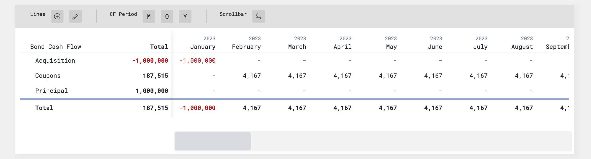

# Cash Flow Visualizer

**Note: This is a Proof of Concept and not a finalized product.**

Cash Flow Visualizer is a JavaScript plugin designed to help you visualize and organize cash flows and other financial data within defined time intervals. It provides a user-friendly table interface with specialized features for displaying and managing cash flows. This tool has potential applications for financial websites, asset management platforms, and listed company websites (displaying P&L and BS).

## Key Features
- **Time Interval Selection**: Easily switch between monthly, quarterly, and yearly views.
- **Scrollable Overflow**: Keep the first section of the table fixed while scrolling to visualize longer cash flow data.
- **Row Styling and Grouping**: Customize row styles to display hierarchical information effectively.
- **Data Manipulation**: Modify data in-place, allowing you to add and remove lines seamlessly.

### Future Additions
I plan to introduce the following features:
- Excel Import and Export
- Excel Copy and Paste
- Built-in Excel Formulas
- Integrated Charts

## Development Roadmap
Our development plans include the following key milestones:

- **Rewrite using React**: I'm planning to rewrite the codebase using React, to enhance the modularity, maintainability of the plugin and provide easier UI updates and events management.

Package into a Shippable Plugin: I need to package the plugin into a user-friendly and easily deployable format once the PoC it's ready.

Excel Integration: As part of future enhancements, I'm planning on integrating Excel capabilities, including import/export, copy/paste functionality, and built-in Excel formulas.

## Installation and Usage
*TO DO*